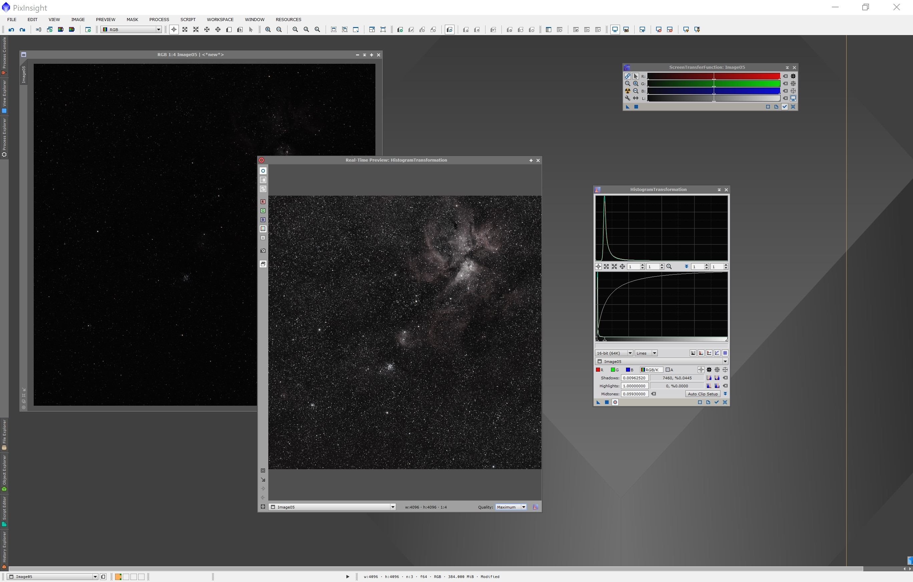

[Volver al inicio <<](https://rmaestre.github.io/)

<hr>

# Estirado

A continuación pasaremos a *estirar* nuestra imagen. Usaremos **MaskedStretch** para estirar la imagen de forma iterativa (poco a poco) creando una mascara de estrellas en cada iteracción para protegerlas.

```
Process >> (All Processes) >> MaskedStretch
```

## 1. Calcular los valores para el estirado

#### A. Resetear/quitar el estirado virtual

Pulsando en el botón *reset* de la herramienta *STF* mostramos la imagen tal como es (se ve toda negra):


### B. Abrir la herramienta HistogramTransformation

Para ello, abrimos la herramienta 

```
Process >> (All Processes) >> HistogramTransformation
```

y realizamos los siguientes pasos (marcados en rojo en la siguiente imagen):

1. Seleccionar la imagen que vamos a estirar (nuestra imagen principal)
2. Resetar los valores de la herramienta
3. Pulsar el tiempo real para ver los cambios en directo


### C. Ajustar la imagen

Para ello, ajustamos primero recortaremos las sombras moviendo el triángulo en la dirección que se muestra en la siguiente figura hasta donde las líneas empiezan a subir:


Ahora, moveremos el triángulo del medio (los medios tonos) hasta que nos guste como queda la imagen.




### C. Obtener las estadísticas de la imagen de tiempo real

Para ello, usaremos la herramienta


```
Process >> (All Processes) >> Statistics
```

1. Seleccionaremos la imagen de tiempo real
2. A continuación obtendremos los tres valores de la fila *median*


Ahora, dividiremos la media entre dos para obtener el valor que usaremos en la herramienta **MaskedStretch**. En nuestro caso es (0.09165 +   0.08817  + 0.08878)/3/2 = **0.0447** 


### D. Resetar el histograma y recortar sombras de la imagen principal

Cerramos la herramienta *Statistics* y reseteamos el histograma.


A continuación:

1. Recortamos de nuevo las sombras hasta donde las líneas empiezan a subir (triángulo de la izquierda)
2. Arrastramos los cambios desde la herramienta *HistogramTransformation* hasta nuestra imagen principal.


### E. Ejecutar *MaskedStretch*

Ahora si, usando el valor calculado anteriormente con la herramienta *Statistics*, en nuestro caso **0.0447**, ejecutaremos la herramienta:

```
Process >> (All Processes) >> MaskedStretch
```
Los pasos son:

1. Poner el valor calculado en en campo *Target background* 
2. Aplicar la herramienta *MaskedStretch* a la imagen principal
3. Resetear el histograma


A continuación,

1. recortemos los medios tonos a nuestro gusto
2. aplicaremos a la imagen para obtener el resultado final


Con esto, habremos estirado nuestra imagen.


<hr>

[Volver al inicio <<](https://rmaestre.github.io/)


