[Volver al inicio <<](https://rmaestre.github.io/)

<hr>

# Identificación

Una vez que se han tomado las imágenes y se han procesado; continuaremos identificando y anotando los objetos que hemos capturado. Existe una herramienta de muchísima utilidad en *Pixinsight* que nos permitirá identificar y anotar objetos de forma automática. Esta es la historia de *la cruz del sur*.


## 1. Configurar el servicio


```
Script >> Image Analysis >> ImageSolver
```


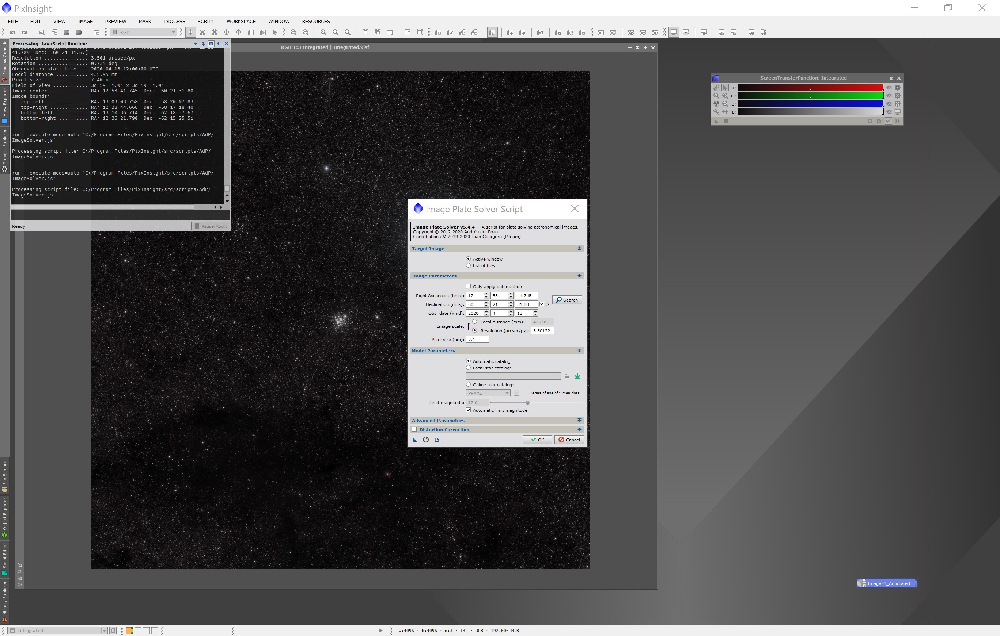

Añadiremos los valores para los parámetros de localización, así como lo parámetros, como se indica en la siguiente imagen:

1. Pulsar el botón *search* para localizar el objeto
2. Se abre una ventana donde vamos a poner uno de los objetos de la imagen, en nuestro caso **NGC 4755**
3. Seleccionamos una opción de la lista
4. Aceptamos la ventana
5. Pulsamos en el botón **ok**, para descargar los datos necesarios del proveedor y realizar algunos pasos como un alineado de estrellas usando los datos descargados y nuestra propia imagen.

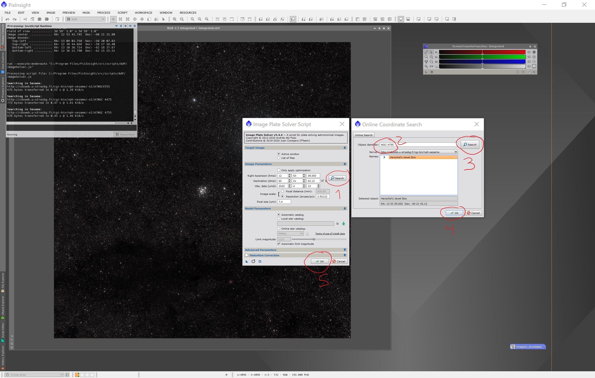


## 2. Obtener información y anotar imagen

El siguiente paso, consiste en elegir "un proveedor" para incluir en la imagen las diferentes capas de información que ofrecen; de cada proveedor podremos elegir anotaciones para estrellas, galaxias, planetas, ....


```
Script >> Render >> AnnotateImage
```


A continuación, seleccionaremos en la lista las capas que queremos: Estrellas, planetas, etc, ... (podemos ir probando).

1.- Para el caso de la imagen que estamos usando en este ejemplo,pondremos una escala de 3.0 para que se lea bien las anotaciones generadas.
2.- Pulsamos el botón *preview*. Se abrirá una ventana con el resultado. Si nos gusta como ha quedado, cerraremos la preview y pulsaremos en el botón *Ok* de la ventana de *Image Annotation Script*. 


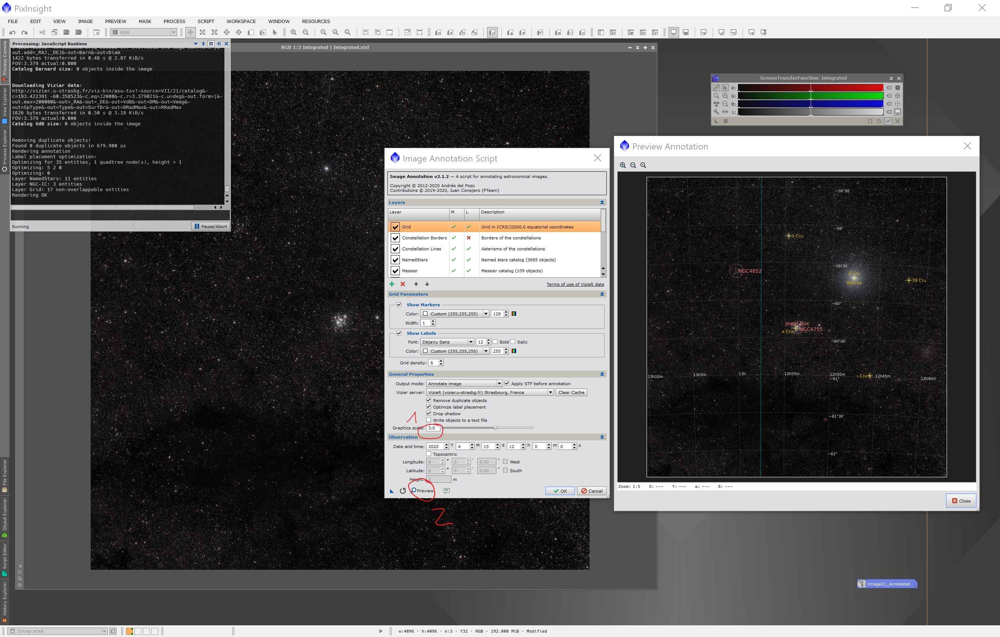


Esto generará una nueva imagen con el resultado final. Podemos ver como ha identificado diferentes objetos:

* El cluster abierto [NGC4852](https://telescopius.com/deep-sky/object/5939/ngc-4852/open-cluster)
* El llamado cluster abierto de *la caja de joyas* [NGC4755](https://telescopius.com/deep-sky/object/5833/jewel-box-cluster/ngc-4755/open-cluster)
* Una estrella subgigante, [Bcrux](https://es.wikipedia.org/wiki/Becrux), con gran luminosidad. Hablaremos mas tarde de esta estrella.
* Una estrella doble llamada [Iota Crucis](https://en.wikipedia.org/wiki/Iota_Crucis)
* ... y una cantidad más de objetos.

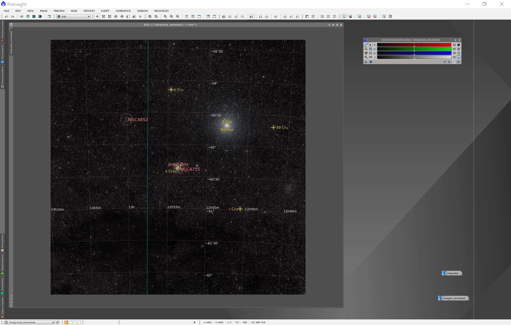


La localización de esta preciosa imagen, estaría en la famosa [*Cruz del Sur*](https://es.wikipedia.org/wiki/Crux). Lo he marcado de forma muy aproximada con un recuadro rojo en la siguiente imagen:

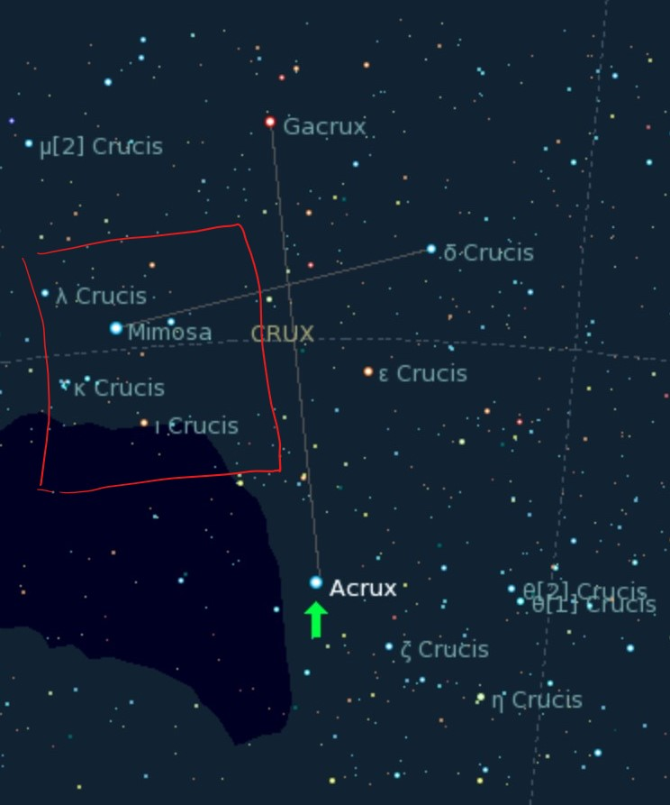([Fuente Wikipedia](https://en.wikipedia.org/wiki/Acrux#/media/File:Acrux_kstars.png)).


## 3. Anotar manualmente

Hay veces que queremos marcar mas objetos e información de los que podemos (o sabemos) detectar automáticamente. Vemos en la imagen anterior, dos objetos muy interesantes. 

1. Una **estrella** con un poco de nebulosa a su alrededor y,
2. una gran mancha negra (sin estrellas) pegada a ella conocida como la **Nebulosa Saco de Carbón** siendo esta una [*nebulosa oscura*](https://en.wikipedia.org/wiki/Dark_nebula). Descubierta en 1499 por el navegante y explorador Español [*Vicente Yáñez Pinzón*](https://es.wikipedia.org/wiki/Vicente_Y%C3%A1%C3%B1ez_Pinz%C3%B3n). [Timeline](https://books.google.es/books?id=kTJzDwAAQBAJ&pg=PT319&lpg=PT319&dq=Vicente+Y%C3%A1%C3%B1ez+Pinz%C3%B3n+dark+nebula&source=bl&ots=SPdTACXace&sig=ACfU3U07RlqIzyzMchNHU-xLOipUGdoQ8w&hl=es&sa=X&ved=2ahUKEwjSrKPt3-foAhWmxoUKHcQVDEcQ6AEwA3oECAsQLw#v=onepage&q=Vicente%20Y%C3%A1%C3%B1ez%20Pinz%C3%B3n&f=false)

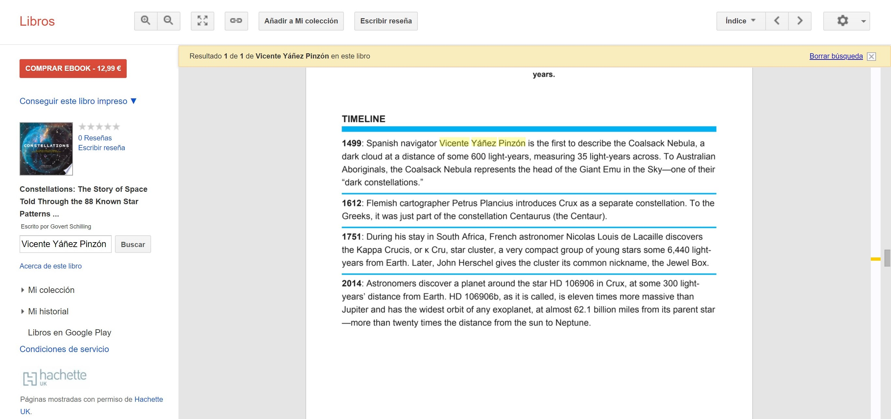


En la siguiente imagen se muestran estas partes:

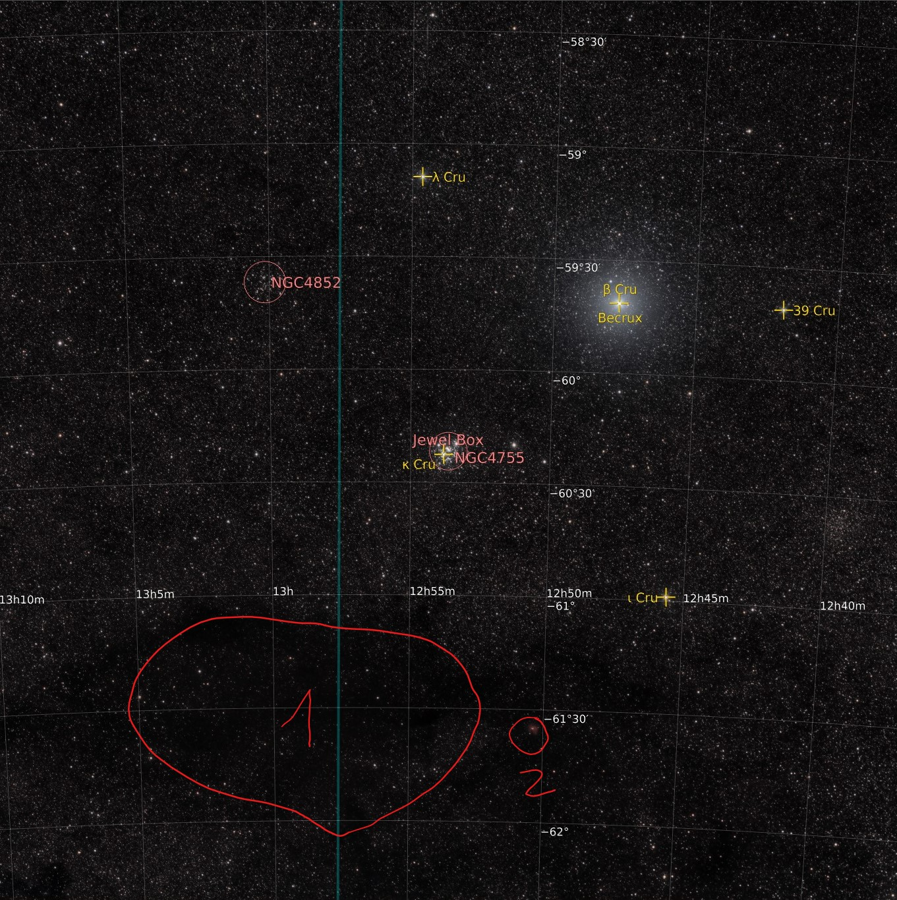


### 3.1 Identificar

Para identificar la estrella, usaremos de nuevo, la siguiente utilidad:


```
Script >> Render >> AnnotateImage
```

En este caso, seleccionaremos el catálogo Tycho-2 con más de 2.5 millones de estrellas identificadas.

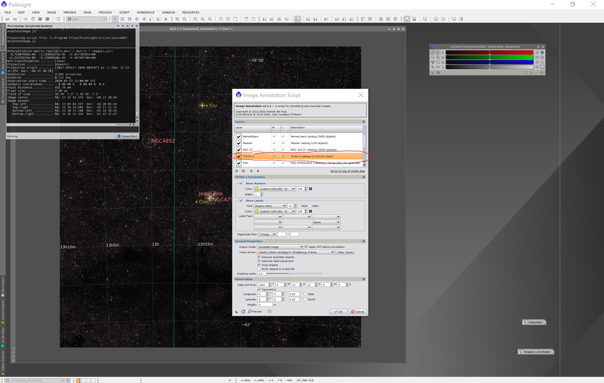

Obtendremos la siguiente imagen, haciendo zoom podremos obtener el identificador de la estrellas que buscamos: *TYC 8988-717-1*

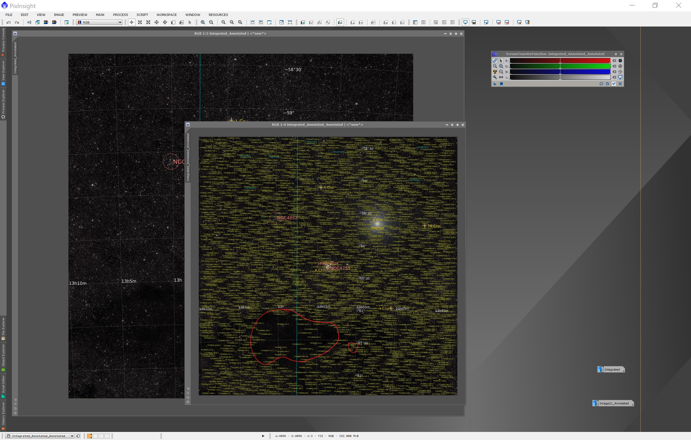

Efectivamente, si la [buscamos usando el visor de Aladine](http://aladin.u-strasbg.fr/AladinLite/?target=HD%20311999&fov=0.033334&survey=P%2fDSS2%2fcolor), obtenemos la información de la estrella.


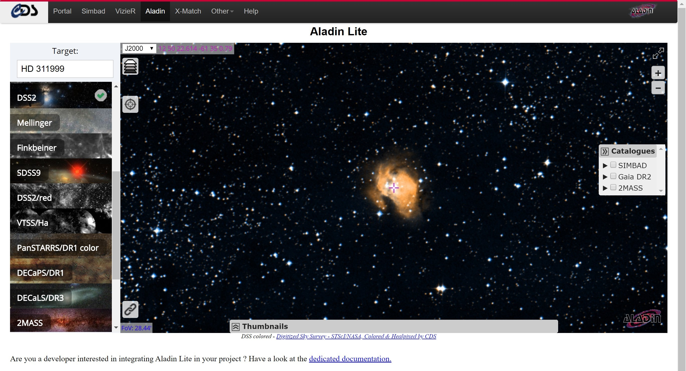

Haciendo zoom en nuestra imagen, comprobamos que el *match* es correcto.
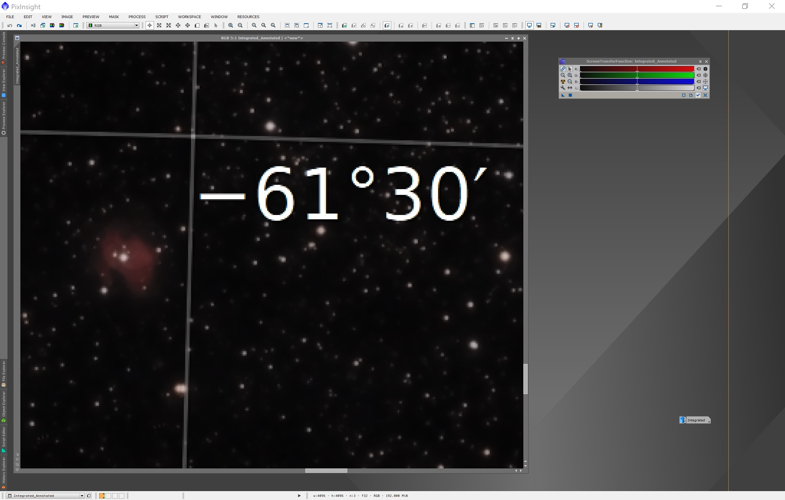


### 3.2 Anotar

Para anotar, tanto la estrella como la nebulosa oscura, usaremos la siguiente herramienta:


```
Process >> (All Processes) >> Annotation
```

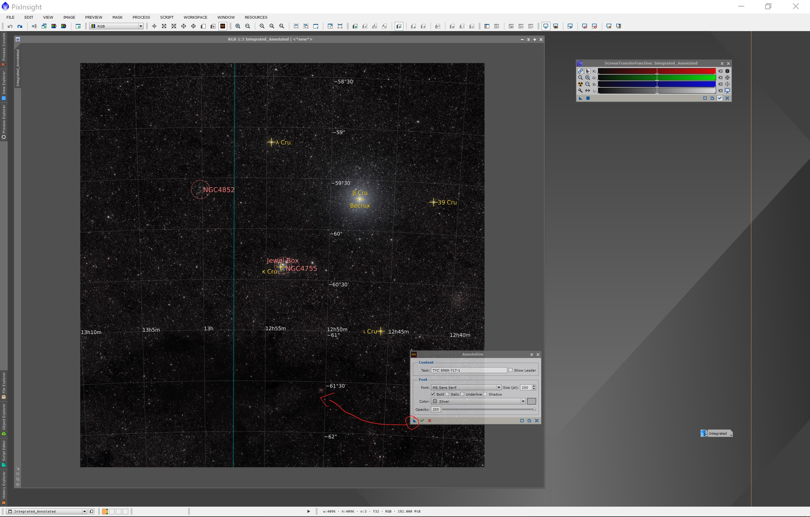

Simplemente, pondremos el texto para la etiqueta y la arrastraremos en la posición que queramos que tenga en nuestra imagen. Repetiremos el proceso poniendo las etiquetas para todos los objetos que necesitemos.

El resultado final, es el siguiente:


