# Introducción

Este pequeño manual está pensado como introducción _práctica y divertida_ a la toma y procesado de imágenes astronómicas en el contexto que se ha producido en nuestras sociedades a raiz del impacto del coronavirus [#YoMeQuedoEnCasa](https://twitter.com/search?q=%23YoMeQuedoEnCasa&src=typed_query).

Son muchos los que me han inspirado a invertir tiempo y preparar los datos y materiales. Un buen ejemplo es el de [Javier Cansado](https://twitter.com/cansado2/status/1239894169365209088) y sus partidas online de juesgos de mesa. Con este su enfoque en mente, pensé que tal vez, la gente pudiera hacer **astrofotografía sin salir desde CASA** ! Es en realidad coomo trabajan los astrónomos y astrofísicos profesionales cuando realizan sus investigaciones, ya que se necesitan equipos muy precisos y con tecnologías avanzadas que son gestionados y mantenidos en centros específicos.

Este pequeño tutorial está pensado para tener un primer contacto con la astrofotografía desde casa, pero siempre teniendo en cuenta **que la parte mas divertida y donde mas se aprende es en el campo con tu telescopio (en mi opinión!)**. A continuación pongo algunos profesionales a los cuales admiro y de los cuales intento aprender: [Javier Martínez Morán](https://twitter.com/jmartinezmoran) o [Álvaro Ibáñez Pérez](https://twitter.com/kokehtz).

Un ejemplo de lo que se puede hacer, con este tutorial, es lo siguiente:

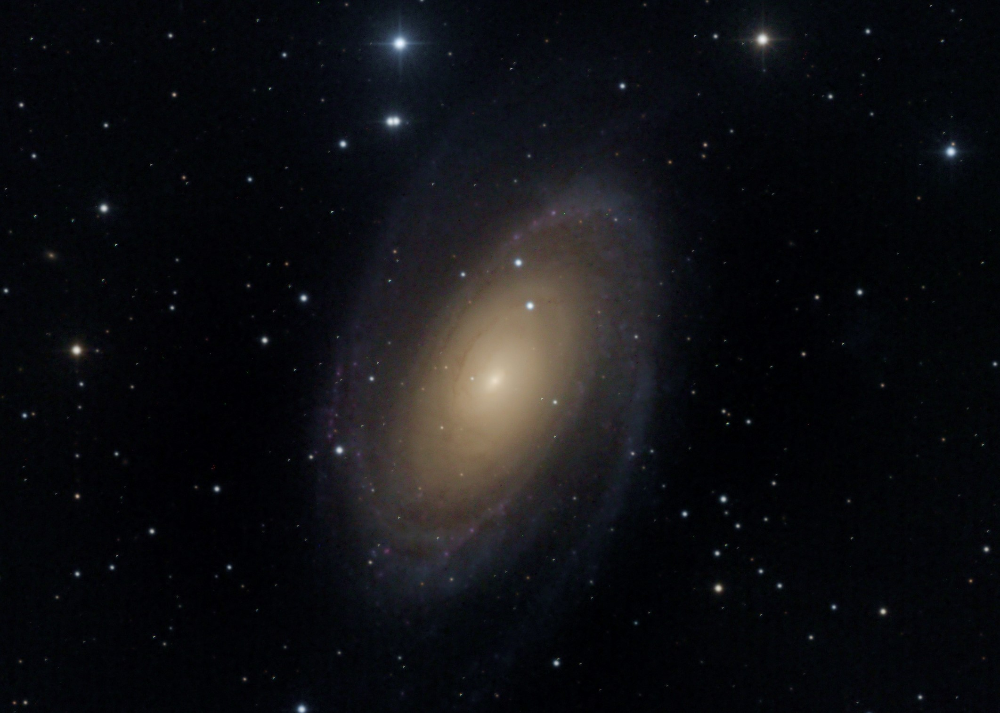

o

# Obtener Imágenes

Para obtener las imágenes tienes dos opciones:

- Irte al campo a un sitio muy oscuro, montar tu telescopio, alinearlo, ponerlo en estación, acoplar tu cámara DSLR o CCD, seleccionar un objetivo en el cielo y empezar a tomar las fotografias. Para tomar las fotografías hay que jugar con muchos parámetros como ISO, tiempo de exposición, ... Finalmente, cuando has tomado las fotografías, hay que tomar imágenes de calibración que luego se ussran para procesar las imágenes.

- Usar usar un servicio remoto de telescopios profesionales (o semi-profesionales) como es el servicio de **[iTelescope.net](https://go.itelescope.net/)**. Con esta opción podras acceder a telescopios de todo el mundo (y por lo tanto a diferentes objetos) y, programar y ejecutar un plan para tomar imágenes de objetos de cielo profundo.

## iTelescope - Red de telescopios remoto

Con iTelescope podras acceder a diferentes telescopios ubicados en diferentes puntos de la tierra, como se muestra en la siguiente imagen. Es un mapa que muesta:

* Las estaciones con telescopios disponibles, como **puntos rojos**.
* El sol, con un **punto amarillo** y el área que ilumina.
* La luna, con su estado (luminosidad asociada).

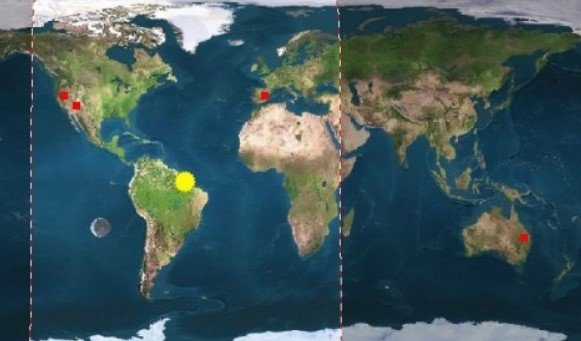

En cada una de las estaciones (puntos rojos del mapa anterior) existen diferentes telescopios que podemos usar para tomar nuestras fotografias. Para ver el listado, deberemos de acceder a la página pricipal de _iTelescope_ y entrar en el *Launchpad*. 

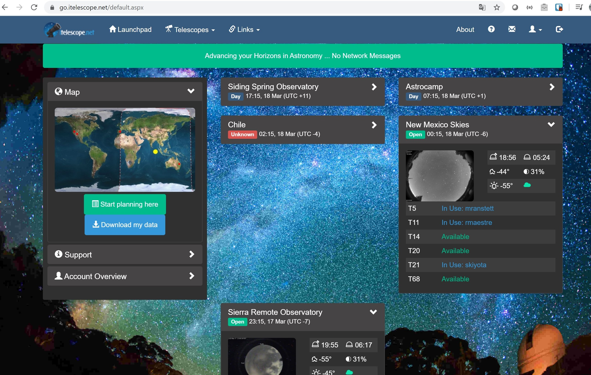

Desde el Launchpad podremos ver el listados de las diferentes estaciones como por ejemplo _Chile_,_New Mexico_,_Siding Spring_,... En cada estación, podremos ver los telescopios con su status: los que están siendo usados y porque usuarios, los que están disponibles y los que están off-line.

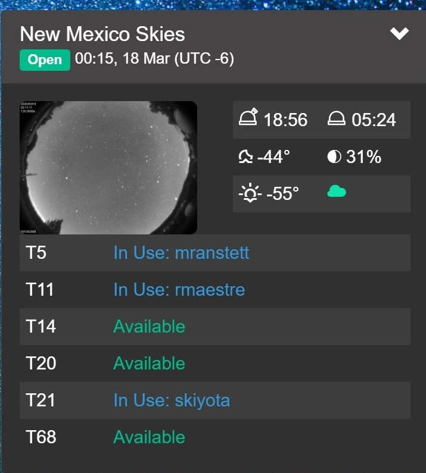

## Trabajar con un telescopio

Los telescopios de la red tienen como identificador una *T* seguido de un número. Para entrar a alguno de ellos y operarlos remotamente hay que pulsar sobre los enlaces que se muestran en la figura anterior.

### 1. Planificar

Lo primero es, dada una estación de trabajo, seleccionar que objetos y a que hora pueden observarse. Para ello, nos apoyaremos en otra excelente herramienta de planificación. Desde [la página principal (o Launhpad)](https://go.itelescope.net/) pulsaremos en el enlace "Start planning here".

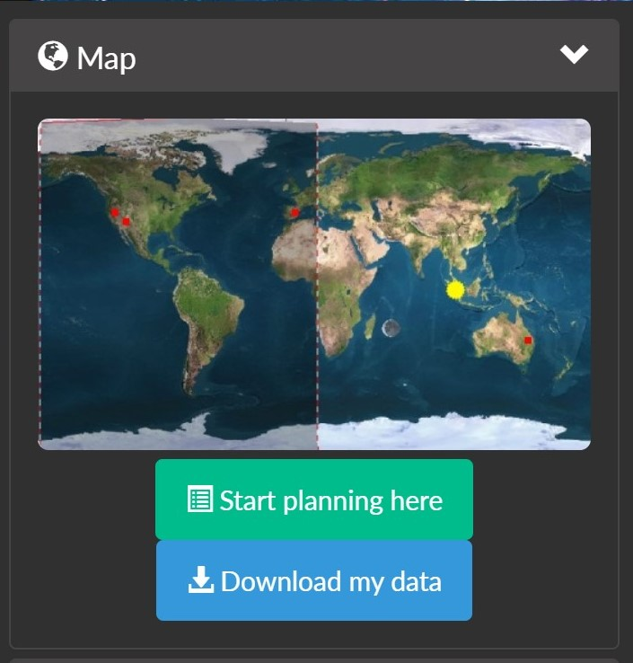

lo que abrirá el siguiente menu donde elegiremos:

* **Site**: La estación de telescopios donde está el telescopio que vamos a operar. Es decir, desde donde vamos a tomar las imágenes.
* **Data**: La fecha para la que planificaremos la toma de imágenes
* **Objet** y *Types*: Criterios para  filtrar los diferentes tipos de objetos.

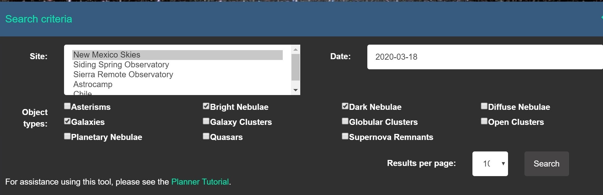

Como ejemplo, yo he buscado que objetos se pueden observar el día *2020-03-18* desde la estación de *New Mexico Skies*

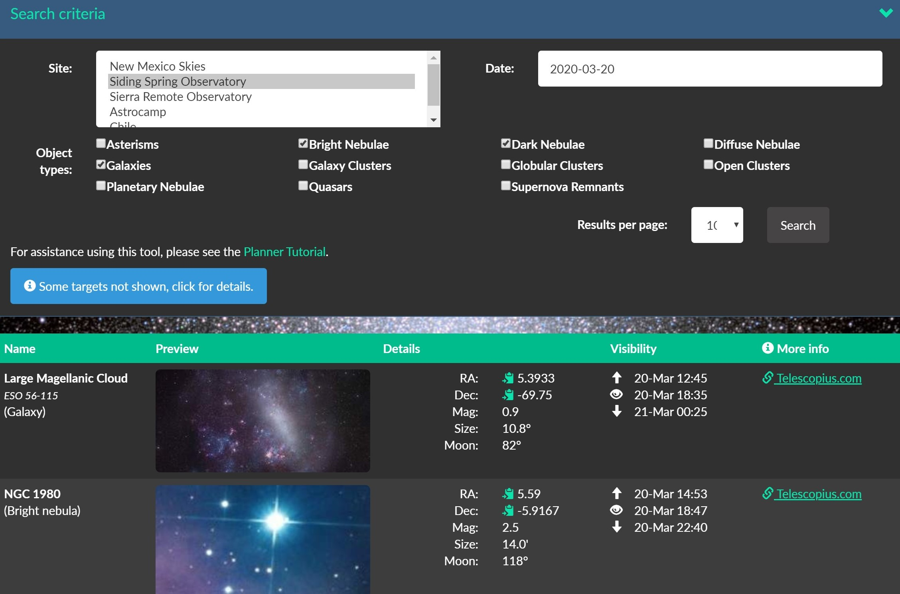

Aparece una lista con los objetos visibles desde la estación de *New Mexico Skies* en el día elegido. Se lista el nombre del objeto, el tipo, su posición (RA,Dec), su maginutd, ... 

**Nota: Un dato muy importante es el de la visibilidad; es decir a que hora se empieza a ver, su hora de tránsito y a que hora se deja de ver.** Podemos ver estos datos en la columna visibilidad. Pulsando en el enlace de _Telescopius.com_ podremos obtener información ampliada sobre el objeto, y en concreto información sobre su visibilidad y tránsito. En este ejemplo, vemos que su mayor altitud es a las 6:34 pm, pero habría que esperar un poco para que se haga de noche y poder fotografiar el objeto.

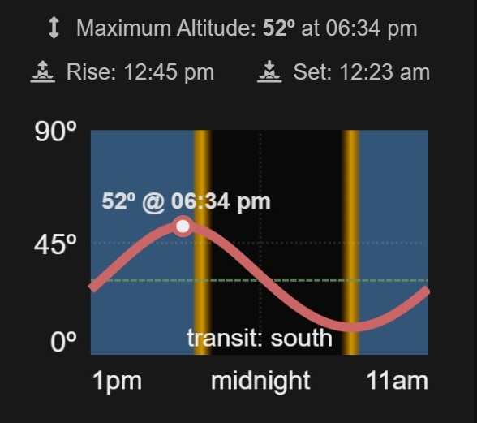

### 2. Acceder a un telescopio

Imaginemos, que hemos seleccionado la nebulosa brillante **NGC 1980** como objetivo de algún telescopio de la estación de *New Mexico Skies* en la fecha seleccionada. El siguiente paso, es crear un plan en el telescopio. Para ello, entramos en el telescopio usando los enlaces de [la página principal (o Launhpad)](https://go.itelescope.net/):

Por ejemplo, entraremos en el telescopio [T11](http://t11.itelescope.net/index.asp#Welcome) y una vez introducido nuestro nombre de usuario y contraseña, nos aparecerá la siguiente página:

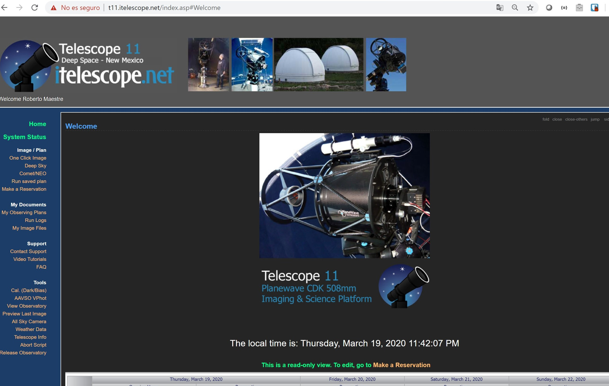

### 3. Crear un plan

Ahora, pulsaremos el enlace ***Deep Sky* para crear un plan. Aparece la siguiente pantalla.

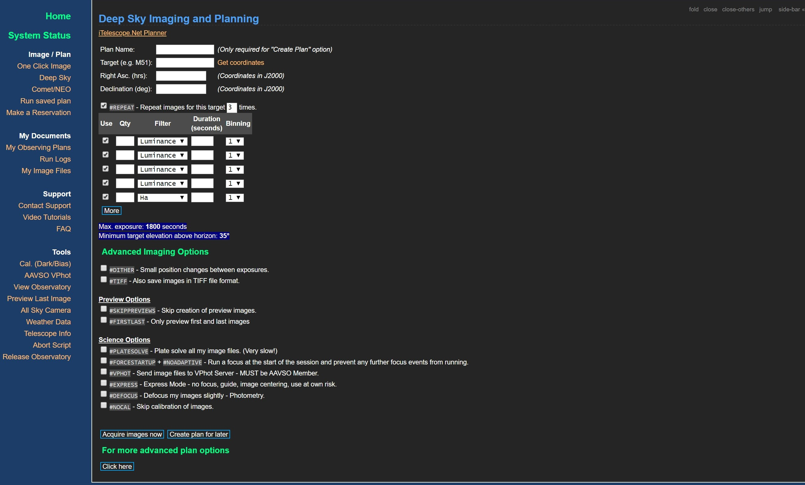

Rellenaremos los campos, *Plan name* con el nombre del plan que queramos, y *Target (e.g. M51):* con el identificador del objeto que queramos fotografiar, en nuestro caso *NGC 1980*. Finalmente, pulsamos en el enlace de la derecha que pone **Get coordinates**, esto nos dirá si podemos observar el objeto desde la estación y nos rellenará automaticamente los campos de Ascensión recta y declinación, como podemos ver en la siguiente imagen.

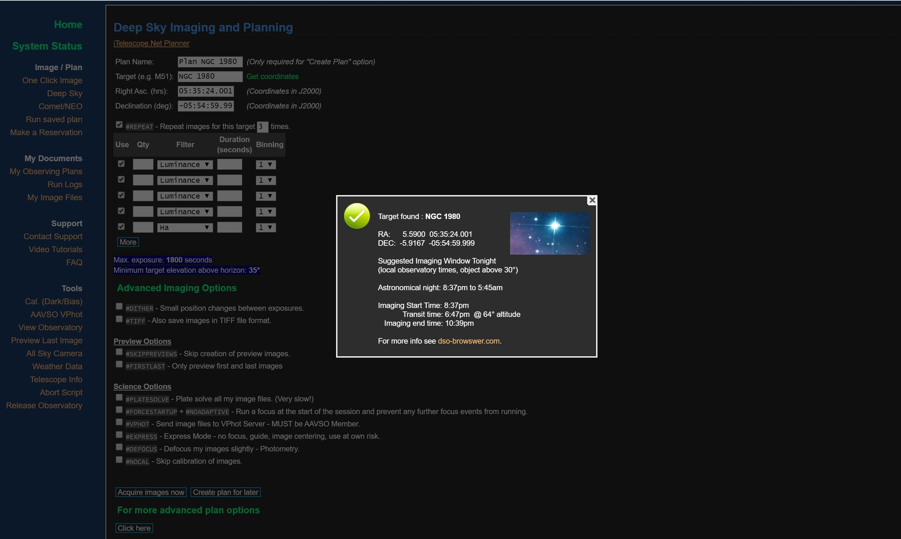

Seguidamente, seleccionaremos los filtros para tomar las imágenes. En este caso tomaré cuatro imágenes con los filtros **L,R,G,B**. Dependiendo del telescopio, se pueden usar mas filtros como HA, por ejemplo. La exposición de cada imagen será de 160 segundos y repetiré la captura de estas imágenes 5 veces; por lo que tendré en total 5*4=20 imágenes y un tiempo total de exposición de 5*4*160=3200 segundos (o 53.3 minutos).

Una vez que tenemos todos los datos del objeto y de los filtros rellenos, procederemos a pulsar el enlace de abajo que pone **Create plan for later**. Esto creará un plan en el telescopio que luego añadiremos a un calendario para su ejecución.

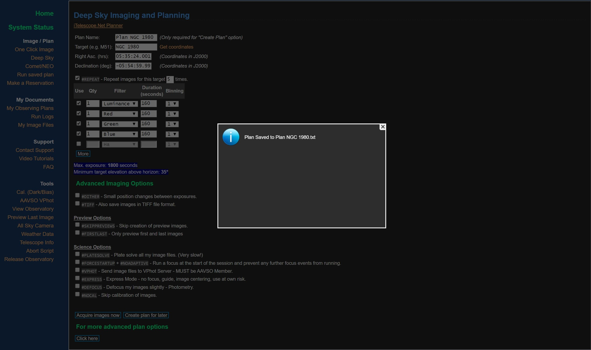

### 4. Reservar

Ahora, solo queda reservar un slot en el telescopio para que se ejecute el plan que hemos diseñado en el paso anterior. Para ellos, pulsaremos el enlace de **Make a reservation* del menú de la parte izquierda. Aparacerá un calendario como el de la siguiente imagen. En el, se marca en verde los espacios que ya han reservado los usuarios para ejecutar una planificación. 

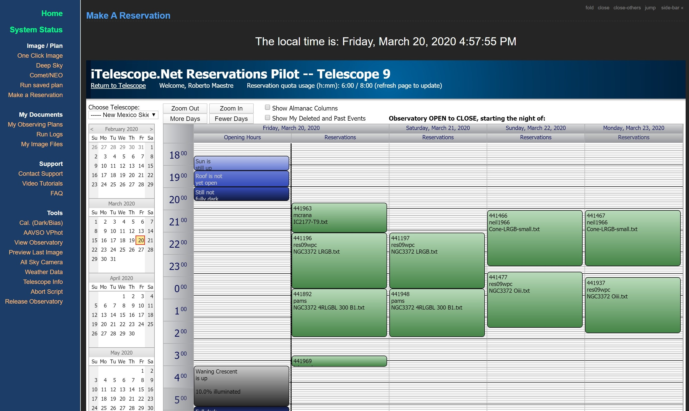

Ahora tenemos que elegir un hueco libre (siempre teniendo en cuenta el tránsito del objeto y su visivilidad) y seleccionarlo pulsando con el ratón en el calendario. Deberemos rellenar:

* **Start Time** y **End time**: el rango seleccionado para la ejecución del plan
* **Plan to run**: seleccionando el nombre del plan que creamos en el paso anterior

cuando todo esté correctamente relleno, pulsaremos el botón *Confirm Reservation*.

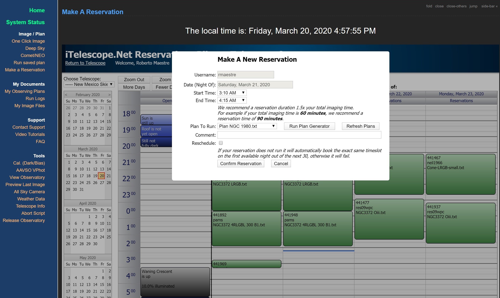

En este paso, aparecerá reservado nuestro espacio en el telescopio para ejecutar nuestro plan. Solo tenemos que esperar !

# Descargar las Imágenes

Una vez el plan se ejecute, nos llegará al correo un resumen del estado de la ejecución, número de imágenes tomadas, visibilidad, etc, ... En ese momento, ya podemos ir al servidor ftp de iTelescope y descargar las imágenes: [Servidor de datos FTP ](https://data.itelescope.net/).

**Nota**: Una cosa interesante, es que podemos acceder a las imágenes ya calibradas. Pero si queremos las imágenes RAW, tendremos también disponibles las imágenes de calibración bias, dark y flats.

Os podéis saltar todos los anteriores pasos y descargar aquí las imágenes de [M-81](http://bit.ly/2QAJ0kZ) y [NGC-3324](http://bit.ly/33zvvrb).

# Procesar Imágenes

En la siguiente publicación !

