[Volver al inicio <<](https://rmaestre.github.io/)

<hr>

# Procesado - Apilado

Aunque existen otras herramientas gratuitas de procesado de imágenes astronómicas, nosotros usaremos [PixInsight](https://pixinsight.com/). Es probablemente el software mas completo y potente que existe en el mercado. Además, dispone de un libro con gran detalle sobre sus herramientas, scripts y funcionalidades.

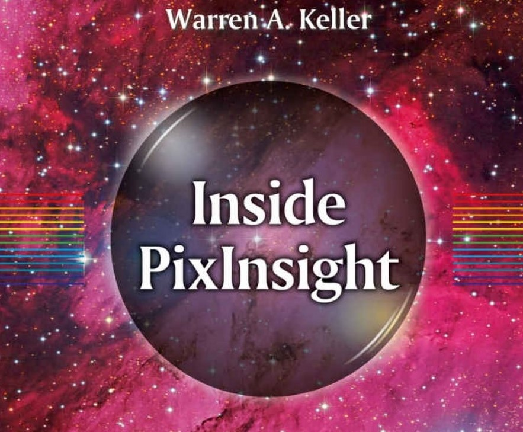

Un tutorial que explica en secuencia los pasos básicos para procesar una imagen puede encontrarse en este [vídeo tutorial](https://www.youtube.com/watch?v=_lqrXaJEs7g). Dado el enfoque de este artículo, yo propongo unos pasos muy resumidos para conseguir un buen resultado en poco tiempo con el objetivo de pasarlo bien y hacer una pequeña iteracción sobre la herramienta con los datos que nos hemos bajado.


## 1. Abrir las imágenes

Lo primero de todo, sería abrir las imágenes (todos los archivos **.fit**).

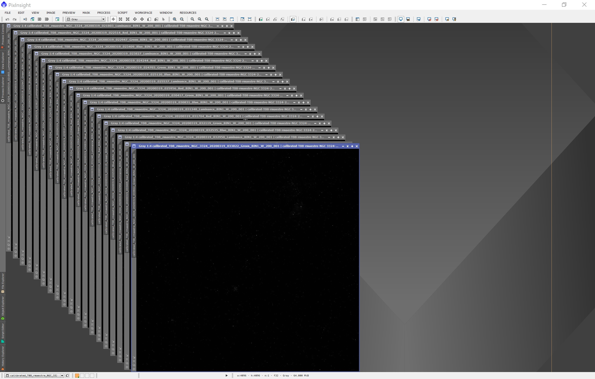

A continuación, usando la herramienta: 
```
Process >> (All Processes) >> Screen Transfer Function
```

cabe recordar que para estirar las imágenes y poder visualizarlas en nuestro ordenadores, hay que pulsar al botón **Auto Strech** que viene en la siguiente imás gen con un círculo rojo:

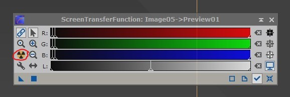


de esta forma, visualizaremos cada una de las imágenes para buscar defectos o posibles errores.

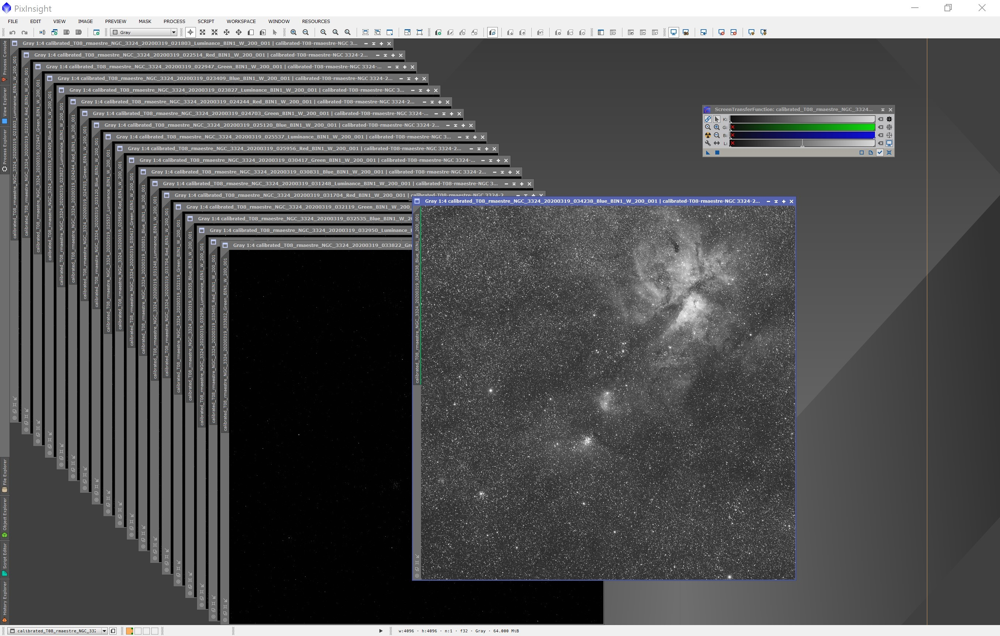

## 2. Alinear las imágenes

El fin último de alinear todas las imágenes, es poder combinar toda la informacion de los diferentes canales (R,G,B,L,Ha,...) que se han tomado en las diferentes exposiciones en una sola imagen maestra. Por lo tanto, lo siguiente que tenemos que hacer, es realizar un alineamiento de todas las imágenes; para ellos, usaremos la herramienta:

```
Process >> (All Processes) >> Star Aligment
```
Simplemente, en primer lugar seleccionaremos una imagen como referencia y en segundo lugar todas las demás para alinear.

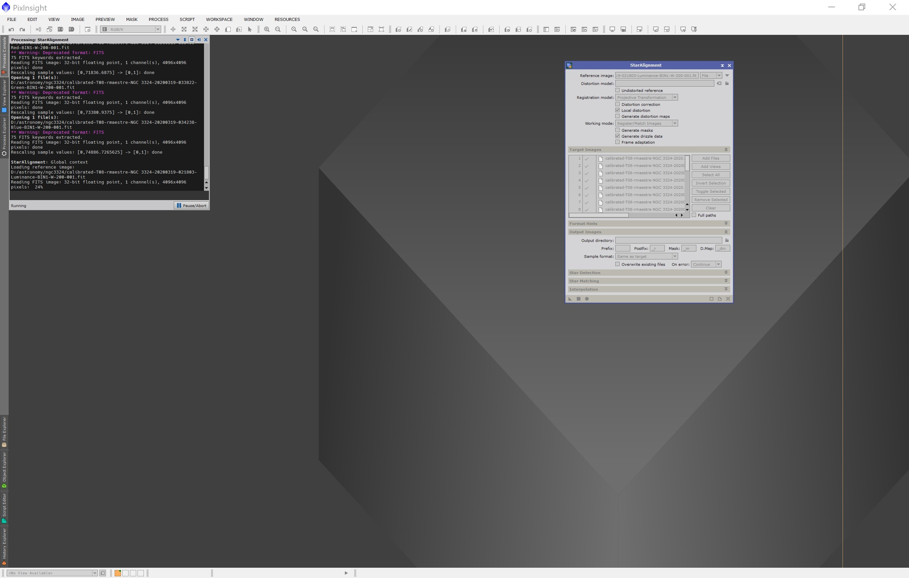

Esto generará, de nuevo todas las imágenes alineadas, como se aprecia en la salida del proceso:

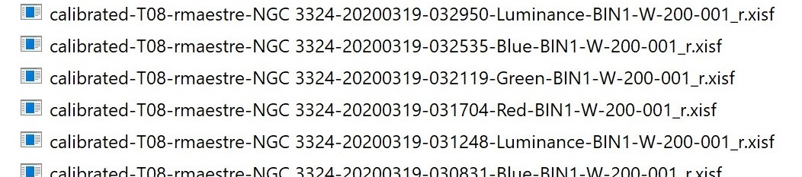


## 3. Integrar los datos de cada canal

Usando las imágenes que hemos alineado en el paso previo, usaremos la herramienta:

```
Process >> (All Processes) >> Image integration
```
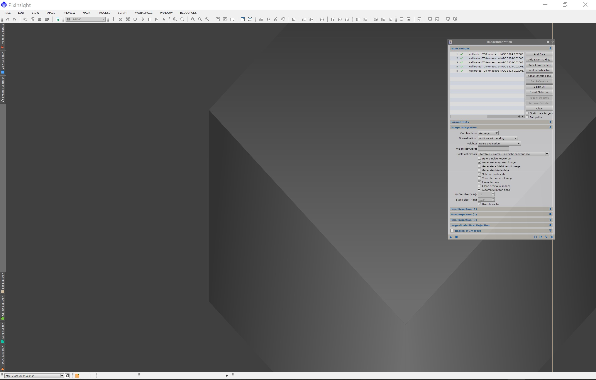

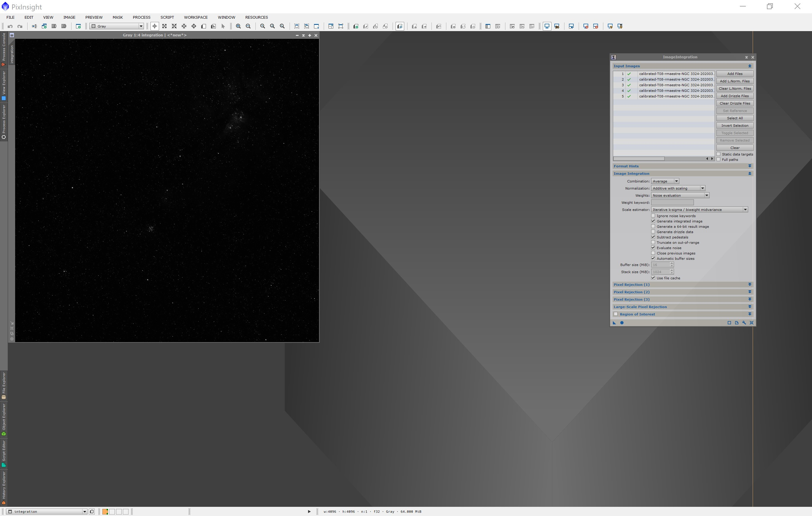


para combinar las señales de cada canal y generar una única imagen por canal. En el ejemplo de la siguiente figura, integramos todas las imágenes del canal de Luminancia (L) obteniendo una sola imagen con todas la información combinada.

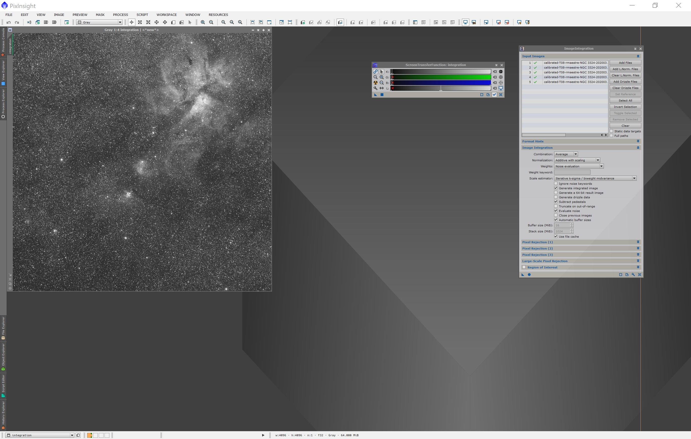

Repitiendo esto para los cuatro canales, obtenemos las siguientes imágenes master:

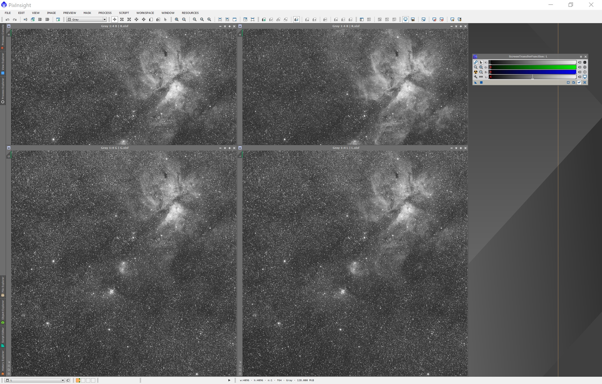


## 4. Combinar canales previamente integrados (LRGB o RGB)

Ahora, podemos combinar las cuatro imágenes integradas previemante: L,G,R y B. Para ello usaremos la herramienta:

```
Process >> (All Processes) >> LRGB combination
```

Como resultado, obtenemos la imagen combinada a partir de los cuatro canales integrados.

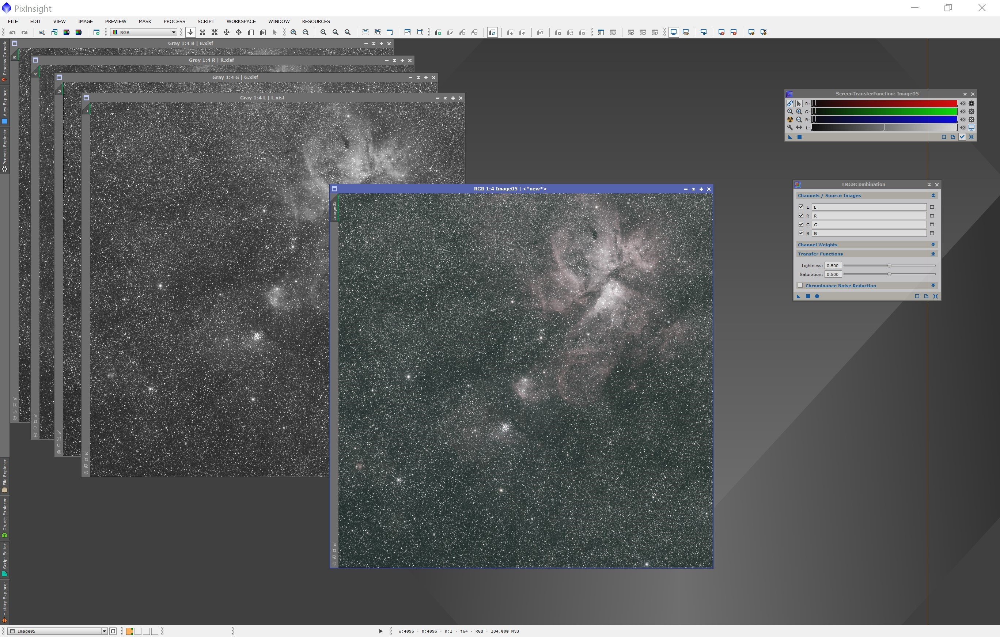

Si no tenemos el canal de Luminancia o solamente tenemos RGB, podríamos usar la herramienta: 
```
Process >> (All Processes) >> Channel Combination
```


A continuación, usando la herramienta: 
```
Process >> (All Processes) >> Screen Transfer Function
```
visualizaremos cada una de las imágenes para buscar defectos o posibles errores.


## 2. Alinear las imágenes

El fin último de alinear todas las imágenes, es poder combinar toda la informacion de los diferentes canales (R,G,B,L,Ha,...) que se han tomado en las diferentes exposiciones en una sola imagen maestra. Por lo tanto, lo siguiente que tenemos que hacer, es realizar un alineamiento de todas las imágenes; para ellos, usaremos la herramienta:

```
Process >> (All Processes) >> Star Aligment
```
Simplemente, en primer lugar seleccionaremos una imagen como referencia y en segundo lugar todas las demás para alinear.


Esto generará, de nuevo todas las imágenes alineadas, como se aprecia en la salida del proceso:


## 3. Integrar los datos de cada canal

Usando las imágenes que hemos alineado en el paso previo, usaremos la herramienta:

```
Process >> (All Processes) >> Image integration
```


para combinar las señales de cada canal y generar una única imagen por canal. En el ejemplo de la siguiente figura, integramos todas las imágenes del canal de Luminancia (L) obteniendo una sola imagen con todas la información combinada.


Repitiendo esto para los cuatro canales, obtenemos las siguientes imágenes master:


## 4. Combinar canales previamente integrados (LRGB o RGB)

Ahora, podemos combinar las cuatro imágenes integradas previemante: L,G,R y B. Para ello usaremos la herramienta:

```
Process >> (All Processes) >> LRGB combination
```

Como resultado, obtenemos la imagen combinada a partir de los cuatro canales integrados.


Si no tenemos el canal de Luminancia o solamente tenemos RGB, podríamos usar la herramienta: 
```
Process >> (All Processes) >> Channel Combination
```

<hr>

[Volver al inicio <<](https://rmaestre.github.io/)
