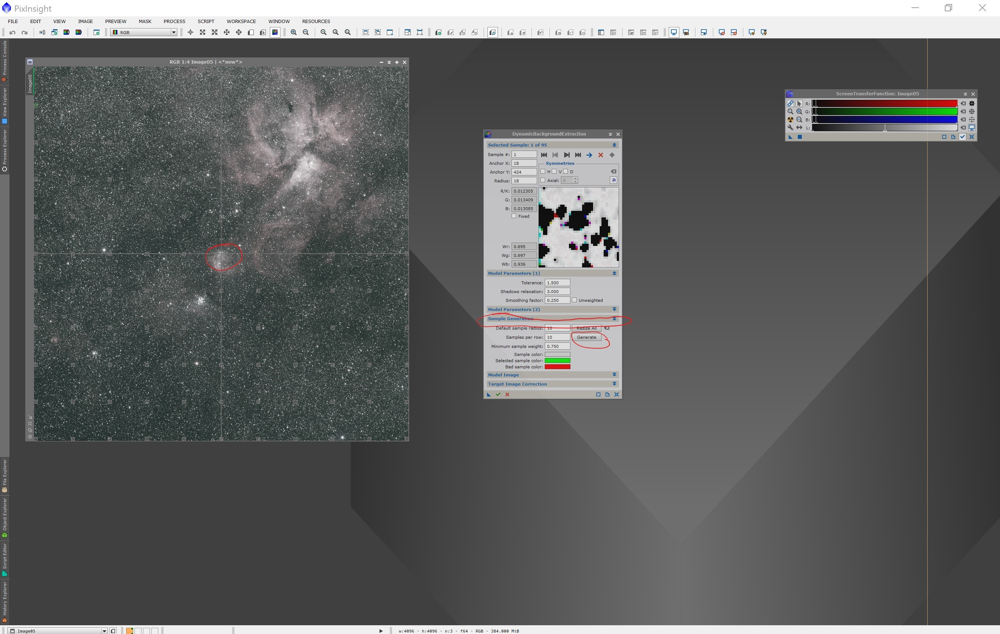

[Volver al inicio <<<](https://rmaestre.github.io/)
<hr>

# Procesado - Calibrado

## 1. DynamicBackground (Extraction)

Usaremos la siguiente herramienta:

```
Process >> (All Processes) >> DynamicBackgroundExtraction
```

La primera acción, es definir puntos sobre el fondo en los sitios mas neutrales. Selecionaremos de forma automática pulsando primero en la imagen y luego en el botón **sample**. La siguiente imagen muestra el resultado:



Una vez que esto puntos se han generado, pulsamos en **Target Image Correction** y seleccionamos: **Correction: Substraction**. Como resultado obtenemos  la imagen corregida con el modelo de fondo que ha sido calculado:


Descartamos el modelo de fondo, y volviendo a pulsar el botón de **Auto strech** de la herramienta **STF** podemos ver la imagen corregida. EN la figura que adjunto, muestro el antes y el después de la corrección de los gradientes de luz:


## 2. BackGroundNeutralization

Usaremos la herramienta:

```
Process >> (All Processes) >> BackGroundNeutralization
```

En este caso, seleccionaremos una preview como referencia donde solo tengamos fondo negro sin estrellas ni estructuras. Con esta imagen de referencia, esta herramienta balancea los canales RGB. Para ello seleccionamos una preview donde solo tengamos fondo negro.


Hay que situar la preview en fondo negro.


Una vez aplicada, tendremos balanceados los tres canales, como se muestra en la siguiente figura:


## 3. ColorCalibration

Ahora procedemos a calibrar el color. Para ello usaremos la herramienta:

```
Process >> (All Processes) >> ColorCalibration
```

Necesitamos crear otra *preview*, en este caso de una zona luminosa. Seleccionaremos parte de la nebulosa. Además, usaremos también la preview del fondo que usamos en el paso anterior.


En este punto, ya hemos calibrado los canales. Revisamos que la mediana estadística de los tres canales se parezca. Para ello usamos la herramienta:

```
Process >> (All Processes) >> Statistics
```

Nos fijatemos que los tres canales tienen el mismo valor en la mediana. En este caso, el canal rojo tiene un poco más debido a la emisión en H-Alpha.


## 4. SCNR

Con esta herramienta, reducimos el sesgo del color. Tipicamente, cuando aparece verde es espúreo y podemos atribuirlo a un error.  Para visualizar este problema, aumentaremos la saturación de toda la imagen para ver estos borrones verdes. Usamos la herramienta:

```
Process >> (All Processes) >> CurvesTransformation
```
y modificando la saturación de la imagen, podemos observar las zonas verdes.


Por lo tanto, si ahora aplicamos la herramienta SCNR con los valores por defecto:

```
Process >> (All Processes) >> SCRN
```


y volvemos a modificar los niveles de saturación, observamos que ese verde ha desaparecido:


<hr>
[Volver al inicio <<<](https://rmaestre.github.io/)


