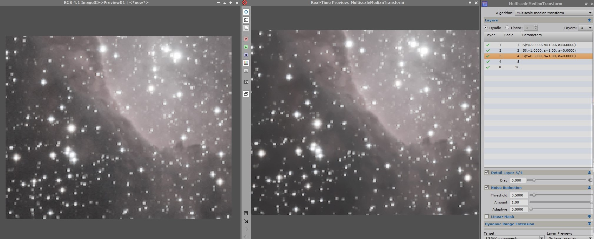

[Volver al inicio <<<](https://rmaestre.github.io/)

<hr>

# Procesado - Reducción de ruido

El siguiente paso es el de reducción de ruido. Para ello usaremos la herramienta **MultiscaleMedianTransform** que es un nuevo proceso basado en descomposición de *wavelets*. 

Antes de empezar con esta herramienta, usaremos el **script** que se encuentra en 

```
Script >> Image Analysis >> ExtractWaveletLayers
```

Al ejecutar este script, se crearan 5 imágenes con diferente información en cada una:


Si ordenamos las capas de menor a mayor terminando por la capa de residuos, podemos observar como en cada una se han ido aislando estructuras de menor a mayor como se observa en la siguiente imagen. 


Usando estos conceptos **MultiscaleMedianTransform** será capaz de reducir el ruido de forma controlada aislando estructuras de diferente tamaño.


## 1. Crear capa de luminancia como máscara

Las zonas luminosas es donde normalmente hay menos ruido, por ello, vamos a crear una máscara de luminancia para protegerlas antes de aplicar **MultiscaleMedianTransform**. Para ello pulsamos en el botón **Extract CIE L* components**.


Ahora necesitamos que el estirado virtual de la máscara de luminancia sea real, para ello hacemos los siguientes pasos:

#### A

Abrir la herramienta:

```
Process >> (All Processes) >> HistogramTransformation
```


#### B

Los pasos son:

1) Pulsando en **STF** deslizamos y soltamos en la barra de abajo de la herramienta de **HistogramTransformation**
2) **HistogramTransformation** aplicamos los cambios a la imagen de luminancia. 


#### C

Como consecuencia, obtenemos una imagen "en blanco". Esto es porque tenemos la herramienta *STF* activada con unos valores para la imagen en virtual, para ya le hemos pasado a real. Simplemente pulsando en el botón "reset" de la herramienta STF obtendremos la imagen real.


#### D

Imagen real obtenida:


#### E

Invertimos la imagen de luminancia desde:

```
Image >> Invert
```


Lo siguiente es iniciar el tiempo real de la herramienta *HistogramTransformation* y resetar sus valores (En la siguiente imagen, marcados con 1 y 2 respectivamente)


A continuación, recortaremos las altas luces usando el triángulo de la derecha (marcado en rojo) moviéndolo donde empieza a crecer la campana.


Cuando este listo, aplicamos los cambios a la máscara:


## 2. Aplicar las máscara a la imagen


Desde el menú :

```
Mask >> Select mask
```


y al pulsar **ok**, aparezá aplicada la máscara a la imagen. Las partes mas rojas protegeran mas la imagen, mientras que las menos rojas protegerán menos la imagen y es donde más se reducirá ruido.


para continuar, sin que nos moleste el rojo de las máscara, pulsaremos 

```
Mask >> Show mask
```

**Nota: La máscara seguirá aplicada, aunque no la veamos.**


## N. Reducir ruido

Ahora sí, estamos listo para reducir el ruido, para ello activaremos la herramienta 
Para ello usaremos la herramienta *MultiscaleMedianTransform**:

```
Process >> (All Processes) >> MultiscaleMedianTransform
```

Primeramente, construiremos una preview para ver el detalle. Nos fijaremos que el ruido desaparezca sin quitar detalle de las estructuras mas grandes.


Usaremos el tiempo real de la herramienta *MultiscaleMedianTransform** usando la preview para ver como funcionan los parámetros que vamos poniendo en la herramienta.


Se observa como el ruido ha desaparecido en las capas con estructuras mas pequeñas (donde reside la mayoría del ruido) pero se ha mantenido las estructuras mas grandes. En la siguiente figura, se muestra mejor esta reducción de ruido:



Cerraremos el tiempo real, y aplicaremos la reducción de ruido a toda la imagen.

<hr>
[Volver al inicio <<<](https://rmaestre.github.io/)


